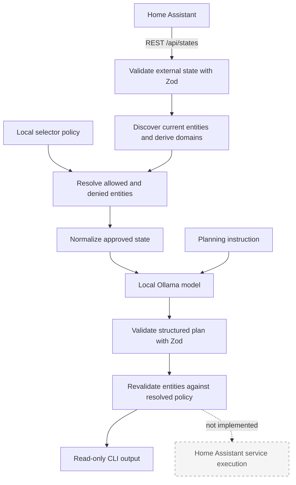

# Home Assistant AI Orchestrator

Home Assistant AI Orchestrator is a local-first, safety-oriented orchestration layer that lets a
local LLM reason about Home Assistant state without giving the model direct control of your home.

Home Assistant remains the source of truth. The model receives only explicitly permitted,
normalized state and produces structured proposed actions that are schema-validated and checked
against deterministic entity policy.

> **Status:** Early development. The current implementation is read-only and cannot execute Home
> Assistant service calls.

## Why this project exists

Connecting an LLM directly to a home automation system conflates several responsibilities that
should remain separate:

- **Reasoning:** deciding what might be appropriate from an instruction and selected context.
- **Authorization:** determining which entities the system is permitted to control.
- **Validation:** checking untrusted model output against schemas and deterministic rules.
- **Execution:** making an approved Home Assistant service call and confirming its result.

An LLM is useful for interpreting intent and proposing a plan, but natural-language output is not
authorization. This project keeps policy and validation in deterministic application code. The
execution stage is intentionally absent while those boundaries are developed and tested.

## Architecture



Discovery determines what exists. Policy determines what the AI may reason about or propose
actions for. Finding an entity in Home Assistant never grants permission by itself.

The current discovery source is `/api/states`. Authoritative device, area, and label relationships
will require separate Home Assistant registry discovery and are not implemented yet.

## Current capabilities

- Home Assistant REST state retrieval.
- Zod validation at external and model-output boundaries.
- Generic discovery of entities present in current Home Assistant state.
- Deterministic domain derivation from `entity_id`.
- Versioned entity policy with `entityId` and `domain` selectors.
- Default-deny and deny-overrides-allow policy behavior.
- State normalization before model exposure.
- Local Ollama `/api/chat` integration with a configurable model.
- Structured JSON plan generation.
- Discriminated plan outcomes: `propose_actions`, `no_action`, and `insufficient_context`.
- Deterministic consistency checks between the outcome and action count.
- Post-model validation against the same resolved entity policy used before normalization.
- Read-only planning from a command-line instruction.

Service and capability authorization are not implemented. A proposed service name is still
untrusted model output.

## Safety model

The current design follows these principles:

- All LLM output is untrusted input.
- Entity authorization is default-deny.
- Deny selectors override allow selectors.
- Unknown and unapproved entities are rejected after model generation.
- Only policy-approved, normalized state is sent to the model—not the full raw Home Assistant state.
- The application independently derives and checks an action's domain from its entity ID.
- Structured output constraints are enforced by application-side Zod validation, even when the
  same JSON Schema is supplied to Ollama.
- Any future execution stage must revalidate policy at the final execution boundary.
- The current application makes no Home Assistant service calls.

Post-model validation currently covers entity policy and domain consistency. It is not complete
execution authorization: service names, service data, entity capabilities, duplicate actions, and
no-op actions do not yet have the deterministic validation required for execution.

## Entity policy

Local authorization is configured in `config/entity-policy.json`:

```json
{
	"version": 1,
	"allow": [{"domain": "light"}, {"entityId": "switch.example_switch"}],
	"deny": [{"domain": "lock"}, {"entityId": "switch.example_critical_device"}]
}
```

Policy semantics:

- Selectors within `allow` are OR alternatives.
- Selectors within `deny` are OR alternatives.
- Fields within one selector are AND conditions.
- An entity must match at least one allow selector.
- Any matching deny selector removes permission.
- An empty `allow` array permits nothing.
- A domain selector intentionally applies to every currently discovered entity in that domain.

Use explicit entity selectors when a domain-wide grant would be too broad. See the
[entity policy documentation](docs/entity-policy.md) for more detail.

## Plan model

Ollama returns a structured proposal similar to:

```json
{
	"outcome": "propose_actions",
	"summary": "Proposed plan: Turn off the example light.",
	"actions": [
		{
			"entityId": "light.example",
			"domain": "light",
			"service": "turn_off",
			"reason": "The explicit instruction requests this non-no-op change."
		}
	]
}
```

This describes a proposal; it does not represent an executed action. The schema enforces these
consistency rules:

- `propose_actions` requires at least one structured proposed action.
- `no_action` requires exactly zero actions.
- `insufficient_context` requires exactly zero actions.
- Every summary begins with `Proposed plan:`.

The model-provided `service` and optional action data are not yet authorized against deterministic
capability or service definitions. They remain untrusted planning data and cannot be executed by
the current application.

## Requirements

- Node.js 24 or newer.
- npm.
- A reachable Home Assistant instance and a Home Assistant long-lived access token.
- A reachable Ollama instance with a local model installed.

The default development configuration uses `gemma4:e2b`. The Ollama integration is intended to
remain model-agnostic where practical, so another locally available model can be selected through
configuration.

The repository includes `.mise.toml` for Node 24. If you use [mise](https://mise.jdx.dev/), you can
install the configured tool version with:

```sh
mise install
```

Mise is optional; any suitable Node.js 24 installation works.

## Installation

```sh
git clone https://github.com/aabiskar1/home-assistant-ai-orchestrator.git
cd home-assistant-ai-orchestrator
npm install
```

## Configuration

Create the local environment file:

```sh
cp .env.example .env
```

The example contains only generic values:

```dotenv
HA_URL=http://homeassistant.local:8123
HA_TOKEN=replace-with-your-home-assistant-token

OLLAMA_URL=http://localhost:11434
OLLAMA_MODEL=gemma4:e2b
```

Set `HA_URL`, `HA_TOKEN`, `OLLAMA_URL`, and `OLLAMA_MODEL` for your environment. The current
implementation has no service-execution path.

Create the local entity policy:

```sh
cp config/entity-policy.example.json config/entity-policy.json
```

Review the policy carefully before running the planner. Both `.env` and
`config/entity-policy.json` are intentionally ignored by Git and must remain local.

## Running

Run the TypeScript entrypoint directly with an explicit planning instruction:

```sh
node --env-file=.env --import=tsx src/index.ts \
  "Review the allowed lights and propose whether any should be turned off."
```

Alternatively, build first and run the generated JavaScript:

```sh
npm run build
node --env-file=.env dist/index.js \
  "Review the allowed lights and propose whether any should be turned off."
```

The CLI reports the number of received, discovered, allowed, and normalized entities; the
validated plan outcome and summary; accepted and rejected proposals; and this final confirmation:

```text
No Home Assistant service calls were made.
```

Output may contain local entity information, so treat terminal logs as installation-sensitive.

## Development

The project uses TypeScript and ESM, Got for HTTP transport, Zod for runtime validation, Vitest for
tests, XO for linting, and Prettier for formatting.

Run the complete local verification suite before committing:

```sh
npm run format
npm run lint
npm run build
npm test
```

Useful individual scripts include `npm run test:watch`, `npm run format:check`, and
`npm run lint:fix`.

## Roadmap

Completed:

- Home Assistant state retrieval and external-data validation.
- Policy-approved state normalization.
- Generic state-based discovery and selector policy.
- Read-only local LLM planning with structured outcomes.
- Deterministic entity-policy and domain validation after model generation.

Next milestone:

- Deterministic capability and service modelling.
- Canonical action and service semantics.
- Validation and normalization of model-proposed services.

Later:

- Home Assistant registry-backed discovery for devices, areas, and labels.
- `areaId`, `deviceId`, and `labelId` policy selectors.
- Richer capability-aware normalization.
- Deterministic action and service-data validation.
- Controlled Home Assistant execution with confirmation.
- Fresh policy validation at the final execution boundary.

Execution will not be added until the deterministic authorization and validation boundaries are in
place.

## Privacy

Local deployment is a design goal, but using Ollama does not automatically guarantee privacy in
every network or deployment configuration. Operators remain responsible for where Home Assistant,
Ollama, logs, and model data are hosted.

- Never commit `.env` or access tokens.
- Keep the real `config/entity-policy.json` local.
- Do not commit raw Home Assistant state or inventory dumps.
- Do not place installation-specific entity IDs, hostnames, URLs, or network addresses in public
  examples, tests, or documentation.
- Review logs before sharing them because read-only planning output can still identify local
  entities.

## Author

**Aabishkar Aryal**

## License

Copyright 2026 Aabishkar Aryal.

Licensed under the [Apache License 2.0](LICENSE). See [NOTICE](NOTICE) for attribution information.

## Contributing and project maturity

This is an early-stage personal open-source project. Changes should stay focused, preserve the
read-only safety boundary, include relevant tests, and pass the complete development verification
suite before submission.
